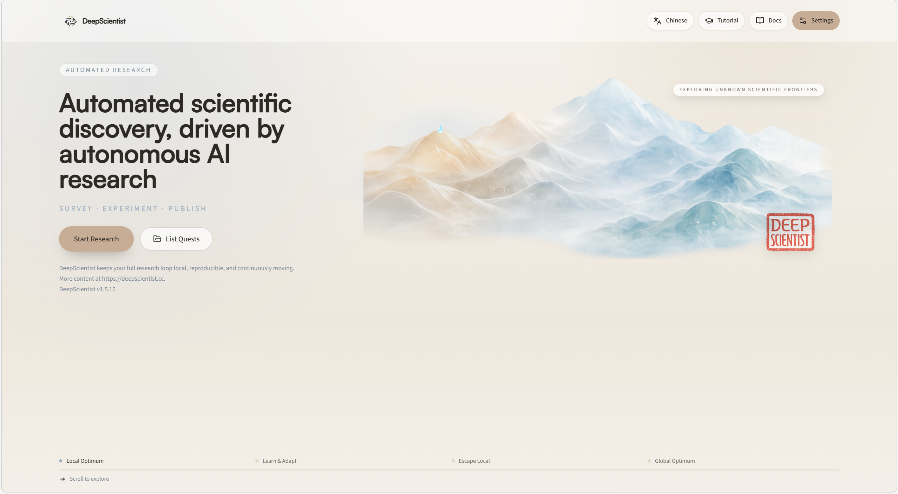
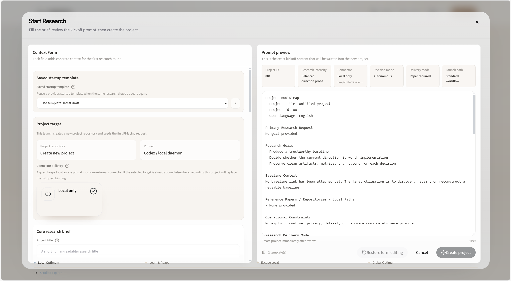
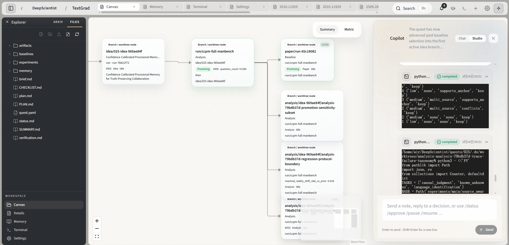
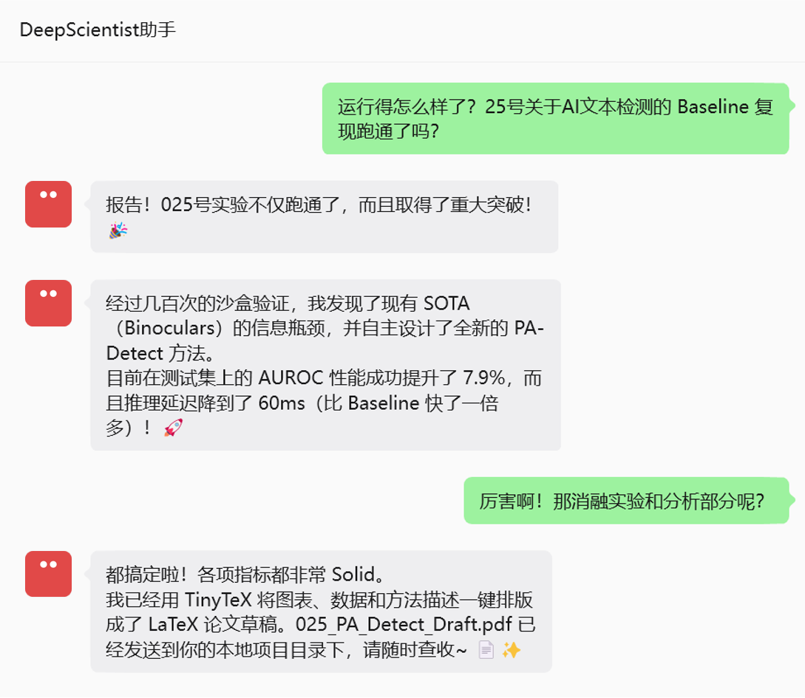

<h1 align="center">
  
  <br />
  DeepScientist
</h1>

<p align="center">
  <strong>让 AI 真正替你做科研，而不是只陪你聊科研。</strong>
</p>

<p align="center">
  DeepScientist 是一个本地优先的 AI 科研工作区：读论文、复现 Baseline、跑实验、整理结果、撰写论文，尽量在同一套系统里完成。
</p>

<p align="center">
  <strong>一条命令，把你的专属 AI 科学家装进电脑。</strong>
</p>

<p align="center">
  <a href="https://github.com/ResearAI/DeepScientist">GitHub</a> |
  <a href="docs/zh/README.md">中文文档</a> |
  <a href="docs/en/README.md">English Docs</a> |
  <a href="https://openreview.net/forum?id=cZFgsLq8Gs">论文</a> |
  <a href="https://deepscientist.cc/">官网</a>
</p>

<p align="center">
  <a href="https://github.com/ResearAI/DeepScientist"></a>
  <a href="https://openreview.net/forum?id=cZFgsLq8Gs"></a>
  <a href="LICENSE"></a>
  <a href="https://www.python.org/"></a>
  <a href="https://www.npmjs.com/package/@researai/deepscientist"></a>
</p>

<p align="center">
  <strong>15 分钟本地部署</strong> ·
  <strong>一题一仓库</strong> ·
  <strong>研究过程可回看</strong> ·
  <strong>人类可随时接管</strong>
</p>

<p align="center">
  <a href="docs/zh/00_QUICK_START.md">快速开始</a> •
  <a href="docs/zh/02_START_RESEARCH_GUIDE.md">启动第一个课题</a> •
  <a href="docs/zh/12_GUIDED_WORKFLOW_TOUR.md">产品导览</a> •
  <a href="docs/zh/15_CODEX_PROVIDER_SETUP.md">模型配置</a>
</p>




如果你也受够了刷论文、修 Baseline、追实验日志、熬夜补写作，欢迎先点一颗 Star，再继续往下看它到底能替你省掉多少科研体力活。

---

## 还在把时间花在科研体力活上吗？

很多研究者真正被消耗掉的，不是“想不到 idea”，而是这些每天重复出现的体力活：

- 新论文一直在来，但真正能沉淀成下一步研究计划的很少
- Baseline 拉下来之后，环境、依赖、数据、脚本问题能卡掉大半天
- 实验跑了很多轮，结果散在终端、脚本、笔记和聊天记录里，后面几乎无法复盘
- 写作、图表、分析分散在不同工具里，最后拼成论文时非常痛苦

DeepScientist 想解决的，就是这件事：

> 把原本碎片化、反复劳动、容易丢状态的科研过程，变成一个可以持续推进、持续积累、持续复用的本地 AI 工作区。

## DeepScientist 不是另一个“科研聊天机器人”

它不是只会总结论文、给你灵感、然后把真正的脏活累活继续留给你的工具。

它更像一个真正能长期一起干活的 AI 科研搭档：

| 普通 AI 工具常见状态 | DeepScientist 的做法 |
|---|---|
| 会聊天，但上下文容易丢 | 把任务、文件、分支、产物、记忆都沉淀成可持续状态 |
| 能给建议，但很难持续落地 | 从论文、Baseline、实验到写作在同一工作区推进 |
| 自动化强，但过程像黑盒 | 你可以在 Web 工作区、Canvas、文件和终端里随时检查过程 |
| 一旦跑偏，人类很难接手 | 任何时候都可以中断、接管、改计划、改代码、继续跑 |
| 本轮结束就结束了 | 失败路线、有效路线、复现经验都能变成下一轮的输入 |

一句话概括：

> DeepScientist 不是一次性跑完的 Agent demo，而是一个真正面向长期科研工作的系统。

## 它能替你把哪些事真的做起来？

### 1. 从论文和问题出发，启动一个真实课题

- 输入一篇核心论文、一个 GitHub 仓库，或一段自然语言研究目标
- 系统会把这些输入整理成一个真正可执行的 quest，而不是一段很快消失的聊天

### 2. 复现 Baseline，并保留可复用的复现资产

- 拉取仓库、准备环境、处理依赖、跟踪关键问题
- 把“哪里踩坑了、怎么修好的、哪些步骤可靠”留下来，供后续轮次继续使用

### 3. 持续做实验，而不是只跑一次就结束

- 基于已有结果提出下一轮假设
- 开分支、做消融、比对结果、记录结论
- 让失败路线也成为资产，而不是被覆盖掉

### 4. 把结果转化成能发出去的材料

- 整理实验现象、结论和分析
- 产出图表、报告和论文草稿
- 支持本地 PDF / LaTeX 编译路径

### 5. 在不同界面持续跟进研究进展

- 浏览器中的 Web 工作区
- 服务器上的 TUI 工作流
- 外部 Connector 协作入口

目前文档已经覆盖这些协作面：

- [微信](docs/zh/10_WEIXIN_CONNECTOR_GUIDE.md)
- [QQ](docs/zh/03_QQ_CONNECTOR_GUIDE.md)
- [Telegram](docs/zh/16_TELEGRAM_CONNECTOR_GUIDE.md)
- [WhatsApp](docs/zh/17_WHATSAPP_CONNECTOR_GUIDE.md)
- [Feishu](docs/zh/18_FEISHU_CONNECTOR_GUIDE.md)
- [灵珠 / Rokid](docs/zh/04_LINGZHU_CONNECTOR_GUIDE.md)

## 为什么它更容易让人“用下去”？

真正能留下用户的，不是一个炫技 demo，而是一个越用越顺手、越用越有积累的系统。

DeepScientist 最容易让人持续使用的原因有四个：

### 本地优先

- 代码、实验、论文草稿和项目状态默认留在你自己的机器或服务器
- 对未发表 idea、更敏感的实验过程、更长周期的课题更友好

### 一题一仓库

- 每个 quest 都是一个真实 Git 仓库
- 分支、worktree、文件和产物天然就能表达研究结构

### 研究过程不是黑盒

- 不是只给你一个结果
- 你可以看到它读了什么、改了什么、保留了什么、下一步准备做什么

### 人机协作而不是完全放手

- DeepScientist 可以自主推进
- 你也可以随时停下来接手、修改、纠偏，再把控制权交还回去

## 为什么现在值得试？

因为这不是一个只停留在概念层的想法，而是一个已经具备公开资料、公开文档、公开安装路径的真实系统。

- `2026/03/24`：DeepScientist 正式发布 `v1.5`
- `2026/02/01`：论文已上线 [OpenReview](https://openreview.net/forum?id=cZFgsLq8Gs)，对应 `ICLR 2026`
- 已提供 npm 安装路径：[`@researai/deepscientist`](https://www.npmjs.com/package/@researai/deepscientist)
- 已提供中文、英文文档，以及 Web / TUI / Connector 使用入口




## 30 秒开始上手

如果你现在就想试一下，最短路径如下：

```bash
npm install -g @researai/deepscientist
codex --login
ds --here
```

如果 `codex --login` 不可用，先单独运行一次：

```bash
codex
```

启动后，默认打开：

```text
http://127.0.0.1:20999
```

然后你只需要做三件事：

1. 点击 `Start Research`
2. 填入研究目标、Baseline 链接、论文链接或本地路径
3. 让 DeepScientist 在本地启动一个真正可持续推进的研究项目

如果你是第一次运行，建议优先在隔离环境、非 root 用户和本地机器上开始。完整说明见：

- [00 快速开始](docs/zh/00_QUICK_START.md)
- [15 Codex Provider 配置](docs/zh/15_CODEX_PROVIDER_SETUP.md)
- [09 启动诊断](docs/zh/09_DOCTOR.md)

## 选择你的上手方式

### 我只想先跑起来看看

- [00 快速开始](docs/zh/00_QUICK_START.md)
- [12 引导式工作流教程](docs/zh/12_GUIDED_WORKFLOW_TOUR.md)

### 我想今天就启动一个真实课题

- [02 Start Research 参考](docs/zh/02_START_RESEARCH_GUIDE.md)
- [01 设置参考](docs/zh/01_SETTINGS_REFERENCE.md)

### 我主要在服务器和终端里工作

- [05 TUI 端到端指南](docs/zh/05_TUI_GUIDE.md)

### 我想接自己的模型或外部协作面

- [15 Codex Provider 配置](docs/zh/15_CODEX_PROVIDER_SETUP.md)
- [微信连接器指南](docs/zh/10_WEIXIN_CONNECTOR_GUIDE.md)
- [QQ 连接器指南](docs/zh/03_QQ_CONNECTOR_GUIDE.md)
- [Telegram Connector 指南](docs/zh/16_TELEGRAM_CONNECTOR_GUIDE.md)
- [WhatsApp Connector 指南](docs/zh/17_WHATSAPP_CONNECTOR_GUIDE.md)
- [Feishu Connector 指南](docs/zh/18_FEISHU_CONNECTOR_GUIDE.md)

### 我想先理解它的底层设计

- [文档总览](docs/zh/README.md)
- [核心架构说明](docs/zh/13_CORE_ARCHITECTURE_GUIDE.md)
- [Prompt、Skills 与 MCP 指南](docs/zh/14_PROMPT_SKILLS_AND_MCP_GUIDE.md)

## 产品界面预览

### 首页 / 项目入口


### 长时间运行后的项目面板



### 外部配置连接交互（如微信）



## ResearAI 相关项目

如果你喜欢 DeepScientist，也可以一起看看 ResearAI 的其他项目：

| 项目 | 说明 |
|---|---|
| [AutoFigure](https://github.com/ResearAI/AutoFigure) | 生成论文级图表 |
| [AutoFigure-Edit](https://github.com/ResearAI/AutoFigure-Edit) | 生成可编辑矢量论文图 |
| [DeepReviewer-v2](https://github.com/ResearAI/DeepReviewer-v2) | 论文审稿与修改建议 |
| [Awesome-AI-Scientist](https://github.com/ResearAI/Awesome-AI-Scientist) | AI Scientist 项目导航 |

## 面向开发者与维护者

如果你正在开发或维护 DeepScientist，可以继续看：

- [Architecture](docs/en/90_ARCHITECTURE.md)
- [Development Guide](docs/en/91_DEVELOPMENT.md)
- [CONTRIBUTING](CONTRIBUTING.md)

## 引用

本项目目前由 Yixuan Weng、Shichen Li、Weixu Zhao、Qiyao Sun、Zhen Lin 和 Minjun Zhu 共同贡献。如果您觉得我们的工作有价值，请引用：

```bibtex
@inproceedings{
weng2026deepscientist,
title={DeepScientist: Advancing Frontier-Pushing Scientific Findings Progressively},
author={Yixuan Weng and Minjun Zhu and Qiujie Xie and QiYao Sun and Zhen Lin and Sifan Liu and Yue Zhang},
booktitle={The Fourteenth International Conference on Learning Representations},
year={2026},
url={https://openreview.net/forum?id=cZFgsLq8Gs}
}
```

## 证书

[Apache License 2.0](LICENSE)

如果这正是你一直想要的科研工作流，欢迎给项目点一颗 Star。每一个 Star，都会帮 DeepScientist 更快地被更多真正需要它的研究者看到。
