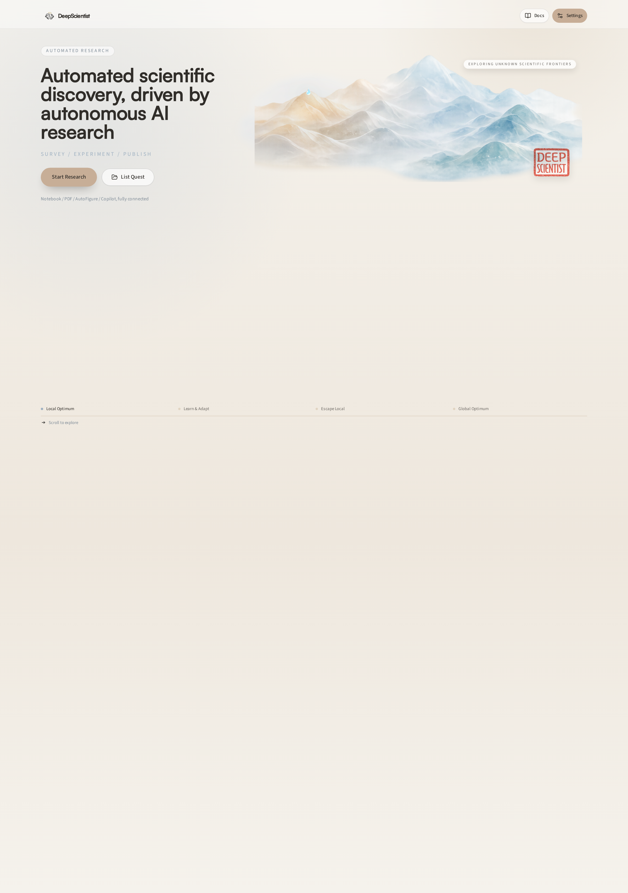
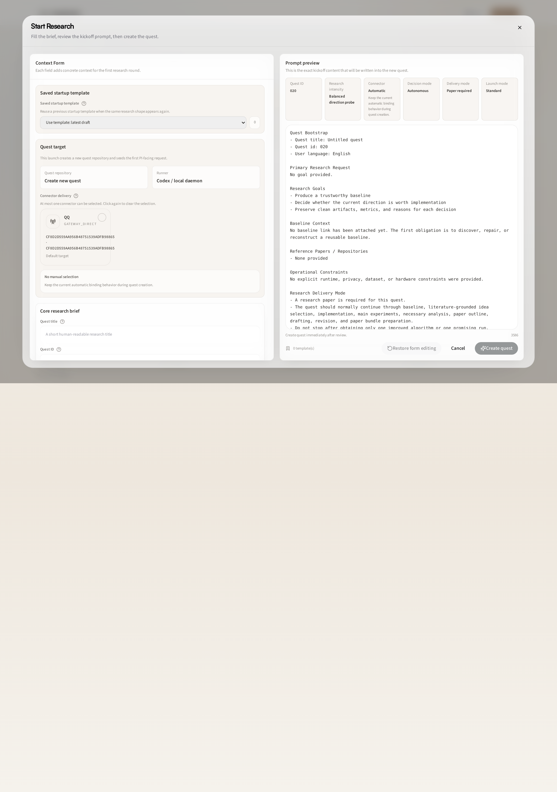
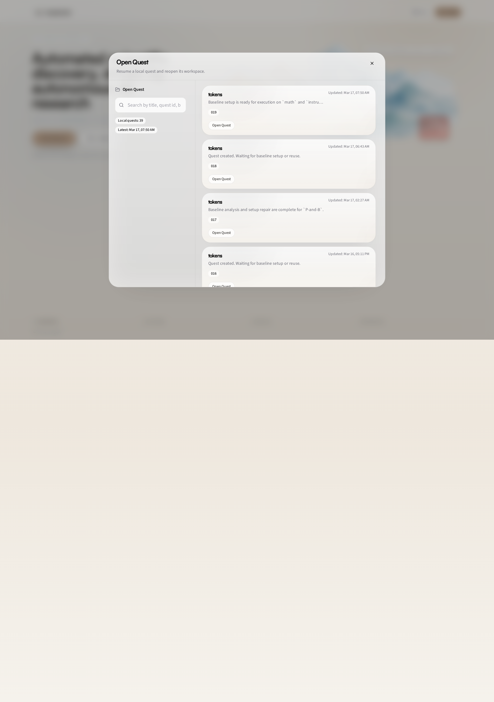

# 00 Quick Start: Launch DeepScientist and Run Your First Quest

This is the fastest way to go from installation to a running quest.

You will do four things:

1. install DeepScientist
2. start the local runtime
3. create a new quest from the home page
4. reopen old quests from the quest list

The screenshots in this guide use the current live web UI at `deepscientist.cc:20999` as an example. Your local UI at `127.0.0.1:20999` should look the same or very close.

## 1. Install

Install Codex and DeepScientist globally:

```bash
npm install -g @openai/codex @researai/deepscientist
```

If you plan to compile LaTeX locally later, you can also install the lightweight PDF runtime:

```bash
ds latex install-runtime
```

## 2. Start DeepScientist

Start the local daemon and web workspace:

```bash
ds
```

By default, the web UI is served at:

```text
http://127.0.0.1:20999
```

If the browser does not open automatically, paste that address into your browser manually.

## 3. Understand the Home Page

When DeepScientist starts, open the home page at `/`.



The home page is intentionally simple. The two main entry buttons are:

- `Start Research`: create a new quest and launch a new research run
- `List Quest`: reopen an existing quest

If you are using DeepScientist for the first time, start with `Start Research`.

## 4. Create a New Quest With Start Research

Click `Start Research` to open the launch dialog.



This dialog creates a new quest repository and writes the startup contract for the agent.

The most important fields are:

- `Quest ID`: usually auto-generated in sequence such as `00`, `01`, `02`
- `Primary request` / research goal: the actual scientific task you want the agent to work on
- `Reuse Baseline`: optional; choose an existing baseline if you want to continue from an earlier result
- `Research intensity`: how aggressive the run should be
- `Decision mode`: `Autonomous` means the agent should keep going by itself unless a true approval is needed
- `Research paper`: choose whether the run should also aim to produce paper-style output
- `Language`: choose the user-facing language for the run

For a first test, keep it simple:

- write one clear research question
- leave baseline empty unless you already have one
- use `Balanced` or `Sprint`
- keep decision mode on `Autonomous`

Then click the final `Start Research` action in the dialog.

## 5. Reopen an Existing Quest With List Quest

Click `List Quest` on the home page to open the existing quest list.



Use this dialog when you want to:

- reopen a quest that is already running or already finished
- search by quest title or quest id
- jump back into a previous workspace quickly

Each row corresponds to one quest repository. Click a quest card to open it.

## 6. What Happens After Opening a Quest

After you create or open a quest, DeepScientist takes you to the workspace page for that quest.

Inside the workspace, the usual flow is:

1. watch agent progress in Copilot / Studio
2. inspect files, notes, and generated artifacts
3. use Canvas to understand the current quest graph and stage progress
4. stop the run only when you intentionally want to interrupt it

## 7. Useful Runtime Commands

Check status:

```bash
ds --status
```

Stop the current local daemon:

```bash
ds --stop
```

Run diagnostics if something looks broken:

```bash
ds doctor
```

## 8. What To Read Next

- [01 Settings Reference: Configure DeepScientist](./01_SETTINGS_REFERENCE.md)
- [02 Start Research Guide: Fill the Start Research Contract](./02_START_RESEARCH_GUIDE.md)
- [03 QQ Connector Guide: Use QQ With DeepScientist](./03_QQ_CONNECTOR_GUIDE.md)
- [05 TUI Guide: Use the Terminal Interface](./05_TUI_GUIDE.md)
