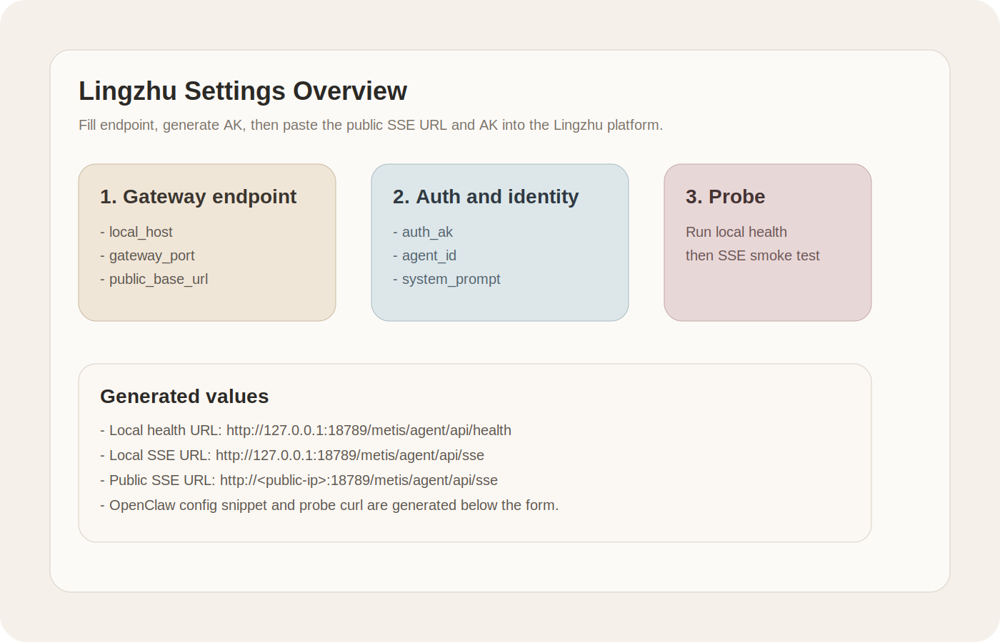
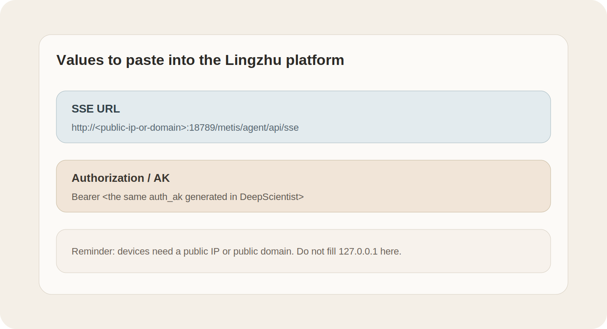
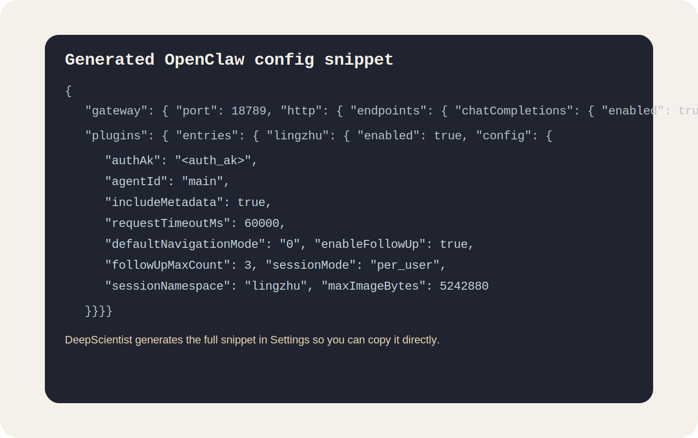

# 04 Lingzhu Connector Guide: Configure Lingzhu for DeepScientist

This guide explains how to configure the Lingzhu companion endpoint from `Settings > Connectors > Lingzhu`.

Scope:

- configuration only
- OpenClaw-compatible Lingzhu bridge values
- local probe and SSE smoke test
- what to paste into the Lingzhu platform

This guide does not cover cloud deployment architecture. You only need one working OpenClaw gateway and one public IP or public domain that the glasses can reach.

Reference sources:

- Rokid forum setup page: https://forum.rokid.com/post/detail/2831
- packaged bridge root: `assets/connectors/lingzhu/openclaw-bridge`
- packaged OpenClaw config template: `assets/connectors/lingzhu/openclaw.lingzhu.config.template.json`

## 1. What DeepScientist now provides

The Lingzhu settings card now generates and validates:

- local health URL
- local SSE URL
- public SSE URL
- `auth_ak`
- OpenClaw config snippet
- local probe `curl`

The packaged bridge is configured to:

- emit one immediate visible receipt acknowledgement before the model starts
- keep comment heartbeats alive
- emit lightweight visible progress heartbeats during long silent upstream phases

DeepScientist treats Lingzhu as a companion endpoint, not as a full bidirectional chat connector like QQ.

## 2. Before you start

Make sure these are already true:

- DeepScientist is installed and running
- your OpenClaw gateway is already running locally
- the OpenClaw HTTP gateway port is known, usually `18789`
- you have a public IP or public domain

Important:

- `127.0.0.1` only works for local health checks
- Lingzhu devices need a public address

## 3. Open the settings page

Open:

- `Settings > Connectors > Lingzhu`

The card is organized into:

- gateway endpoint
- auth and identity
- generated values
- probe and verify
- advanced debug



## 4. Fill the endpoint fields

Recommended values:

| Field | Recommended value | Notes |
| --- | --- | --- |
| `Enabled` | `true` | turn on the companion config |
| `Transport` | `openclaw_sse` | fixed, do not change |
| `Local host` | `127.0.0.1` | used only for local probe |
| `Gateway port` | `18789` | match your OpenClaw gateway |
| `Public base URL` | `http://<public-ip>:18789` | must be reachable from the glasses |

If you do not know what to fill for the local endpoint, click:

- `Use local defaults`

## 5. Generate the AK and identity values

Fill or keep:

| Field | Recommended value |
| --- | --- |
| `Auth AK` | click `Generate AK` |
| `Agent ID` | `main` |
| `Lingzhu system prompt` | optional |

Use the same `auth_ak` and `agent_id` in both places:

- OpenClaw Lingzhu plugin config
- Lingzhu platform config

## 6. Use the generated values

DeepScientist shows the exact values you need:

- local health URL
- local SSE URL
- public SSE URL
- OpenClaw config snippet
- probe curl

The public value is the one you should paste into the Lingzhu platform.



## 7. Update OpenClaw

Use either:

- the generated snippet in the settings page
- or the packaged template at `assets/connectors/lingzhu/openclaw.lingzhu.config.template.json`

Install the packaged bridge with:

```bash
openclaw plugins install ./assets/connectors/lingzhu/openclaw-bridge
```

At minimum, OpenClaw must expose:

```json
{
  "gateway": {
    "port": 18789,
    "http": {
      "endpoints": {
        "chatCompletions": {
          "enabled": true
        }
      }
    }
  }
}
```

DeepScientist also generates the full Lingzhu plugin block for you:



## 8. Run the local probe

After saving the values, click:

- `Run Lingzhu probe`

DeepScientist performs:

1. `GET /metis/agent/api/health`
2. `POST /metis/agent/api/sse`

Expected result:

- `Connection = reachable`
- `Auth = ready`
- probe result returns no errors

## 9. What to paste into the Lingzhu platform

Use:

- `Public SSE URL`
- `Auth AK`

Do not paste:

- `127.0.0.1`
- any local-only host name

## 10. Common failure causes

### Health is offline

Usually means:

- OpenClaw is not running
- wrong `gateway_port`
- wrong `local_host`

### SSE probe fails

Usually means:

- `auth_ak` mismatch
- Lingzhu endpoint path is not exposed
- OpenClaw `chatCompletions.enabled` is still off

### Device still cannot connect

Usually means:

- `Public base URL` is not public
- firewall or reverse proxy still blocks the port

## 11. Practical note

This settings surface is intentionally registry-first:

- Lingzhu stays in `connectors.yaml`
- generated values come from the same structured config
- validation, testing, and frontend rendering consume the same connector record

For long-running tasks, the most stable practical behavior is:

- immediate bridge-level receipt acknowledgement
- visible progress heartbeats from the bridge during silent upstream phases
- preserved per-user session continuity across follow-up turns

This improves Lingzhu compatibility, but it still does not remove the platform-side single-request timeout limit.
